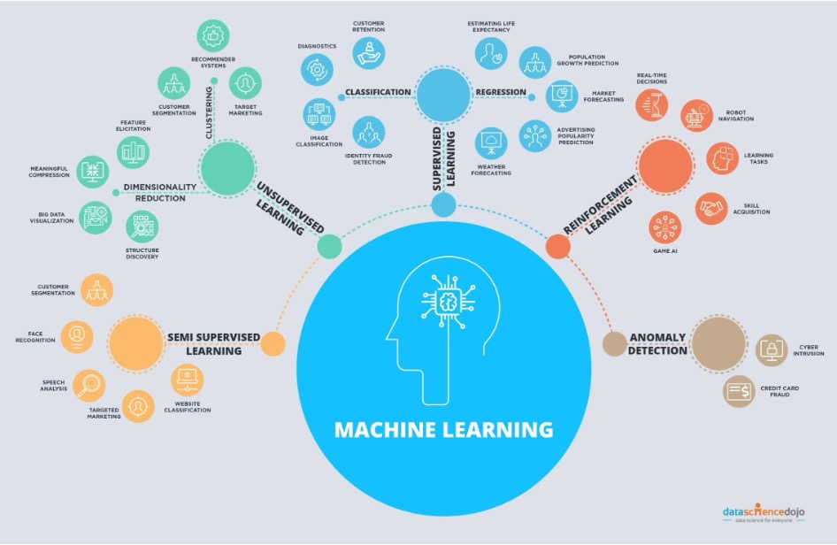
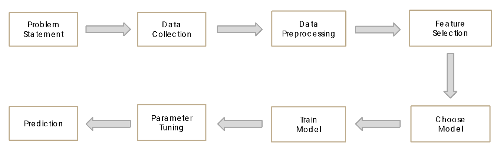

# What is machine learning?

Artificial Intelligence (AI) broadly refers to techniques which enable machines to mimic human behavior. Machine learning (ML) is a subset of AI that uses a variety of statistical algorithms to learn from data. Machine learning methods
automatically learn from data, improve performance with new observations, and predict without being explicitly programmed to perform a specific task.
These algorithms use ideas from statistics, information theory, mathematics, and computer science. In this course we will focus on how classic machine learning
as well as deep learning can be used in the context of climate science and environmental sustainability. Classic machine learning includes a number of different algorithms
that have been developed over the past century to learn from data. Deep learning, a subset of machine learning, refers to methods that focus on using deep neural networks (a specific type of machine 
learning algorithm that we will discuss later in this course) that has become increasingly popular since ~2011, when these methods began to outpace other machine learning methods on computer vision tasks.

*Image source: [https://www.edureka.co/blog/ai-vs-machine-learning-vs-deep-learning/](https://www.edureka.co/blog/ai-vs-machine-learning-vs-deep-learning/)*

## Machine learning algorithms
There are many different types of machine learning algorithms that have been developed over the past century. 

*Image source: [https://datasciencedojo.com](https://datasciencedojo.com)*

Machine learning can be broadly divided into three different types of learning paradigms:
**supervised machine learning**, **unsupervised machine learning**, and **reinforcement learning**. **Supervised machine learning** refers to learning from labeled data sets. We 
tell the machine learning model what answer we want to have from some example data sets, and the model learns how to predict those labels. By contrast, **unsupervised machine learning** 
does not require labeled data sets, but rather identifies underlying patterns and correlations inherent to the data itself. Finally, **reinforcement learning** refers to learning through interaction with the surrounding environment in order to maximize some reward function; an example would be a robot trying to learn how to pick up an apple through repeated trials. 

In this course we will focus on supervised and unsupervised machine learning, and discuss some of the ways that these two paradigms can be applied to climate science and environmental sustainability.

## How does Machine Learning work?
We'll discuss the details of specific algorithms and machine learning methodologies over the next couple of weeks, but the application of all machine learning models takes a similar approach:

*Image source: *

1. **Problem statement:** We first need to define the problem we are interested in solving. For machine learning, this is generally a task that can be framed in terms of classification or regression. 
*Classification* refers to identifying a sample as belonging to one of a fixed set of classes (for example, does the image show a cat or dog?), while *regression* refers to predicting a continuous value for a variable (for example, what value between 0 and 10 is y?).
Because machine learning attempts to find complex relationships from the data itself, it also allows us to develop models to answer questions we typically can't frame as a mathematical or physics based model. The classification of an image as showing a cat or a dog is a good example of this.
It's not obvious how we would develop a generalizable mathematical model to solve this problem, but this is a problem that is tractable with machine learning.
2. **Data collection:** We need to collect data that can be used to solve the problem that we have defined. In environmental science, these data sets can be observations (like satellite radiances or environmental sensor data) or model output, and often includes high-dimensional spatio-temporal data sets.
3. **Data preprocessing:** Data preprocessing consists of preparing and standardizing the data sets so that they can be fed into the machine learning algorithms. Many machine learning algorithms work best if variables are normalized to lie within a specific range (for example, between 0 and 1) and with data 
transformed such that variables are normally-distributed. If our task involves *supervised* machine learning, we also need to provide labels for our data sets (for example, labeling images as cats or dogs). 
We also need to split our data set into a *training* data set and a *test* data set. The training data set is the data that we use to train our machine learning model, while the test data is the data that we use to determine how well our trained machine learning model can generalize to new cases (which it has not seen during the training process).
4. **Feature selection:** As input to the machine learning models, we identify specific variables or aspects of the data that we expect the machine learning model can use to solve the problem that we have defined. Classic machine learning models typically require careful "feature engineering"-- where we 
identify specific attributes of our data sets that the model is most likely to learn from, while deep learning is capable of learning higher dimensional features from the data itself. We'll discuss this distinction more in later classes.
5. **Model selection:** Once we have prepared the data and identified features, we select a machine learning algorithm for our problem. Different algorithms have different strengths and weaknesses, and are more appropriate for specific types of data. For example, there are 
models that are more appropriate for sequential data (e.g. time-series), spatial or spatial-temporal data, or graph-structured data sets. By selecting the appropriate model for our data set and problem, we can significantly reduce the amount of data that might be required and optimize the amount of time 
that is required to train the models.
6. **Model training:** Machine learning models are trained by defining a loss function. For the case of supervised machine learning, the loss function is defined as the difference between the current prediction of the machine learning model and the "ground-truth" that we provide to the model from our labeled data sets. 
We use an algorithm to optimize the weights of our models in order to minimize this loss function. 
7. **Hyperparameter tuning:** Machine learning algorithms typically include a number of choices for what we call "hyper-parameters". These are settings or choices we make when setting up the machine learning algorithm that are not optimized by minimizing the loss function,
but can still affect the prediction of the model. 
8. **Prediction/inference:** Finally, once we have a trained machine learning model, we use the trained machine learning model on new data to perform the task that we have defined. 

